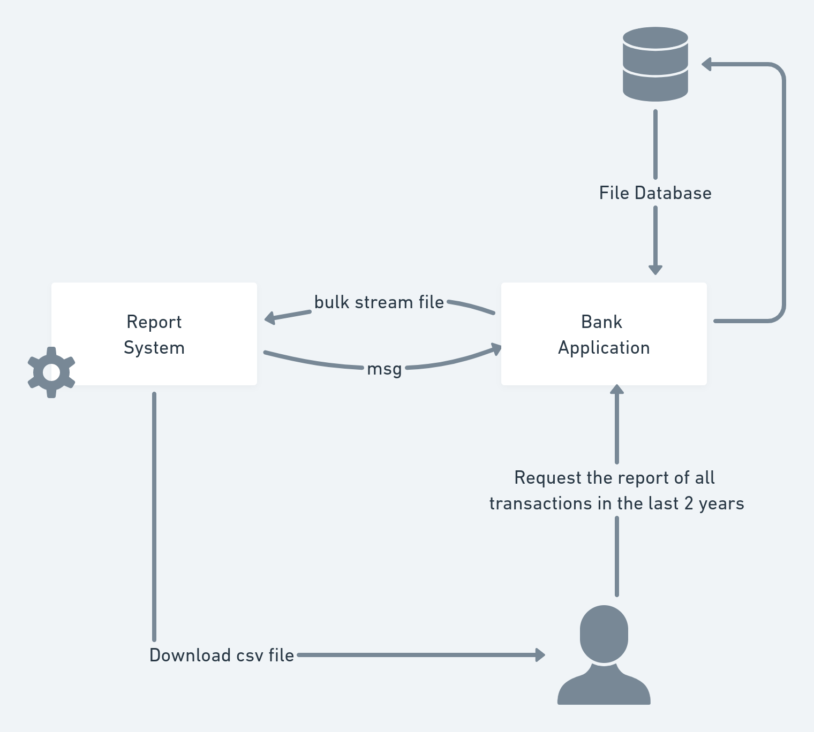
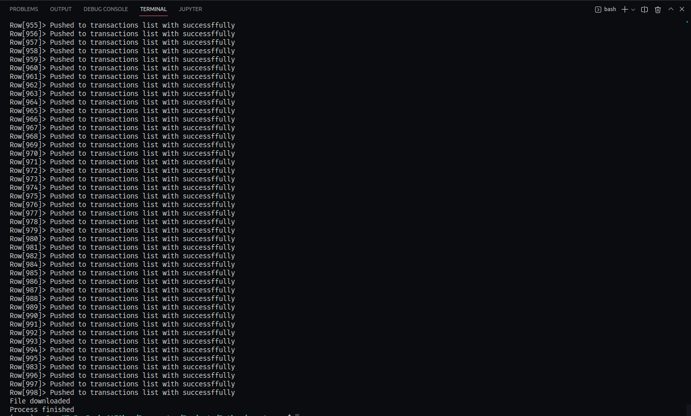

# Streams of bulk data

Streams is a resource used or that help to process bulk data  between worksheet on-demand.
An example of a case to use streams:

    Ex:
        You wish to generate the yearly report of all sales maked in your company.

In this case, you will process mass data, and if you use streams, you can process faster and more performantly.

I will develope an example simulating a microservices where I create a bank service and report service using streams to paste data and threads.

Usecase of project is:

- The user request the history of all transactions that he maked in the last 2 years on bank.

The bank notify the report system service with the credentials of user and the report system will generate a json file with all transactions of user in the last 2 years and maked the download to user. After will notify to bank system again that the process already finish.

Bellow you see the figure.

This is the part responsible for generating the reports and downloading them.

Example:

I have a file with the name `bulkData.file` is a bulk data file, I treated this file and pasted to other file. Simulating that I send to other service for example.

## Features
The tasks that already implemented are:

- [x] The system of report already generate the json file with transactions data.
- [ ] Create service where the user request your transactions (Go lang).
- [ ] Notification between system when the process already finish.
- [ ] Download json file or csv.
- [ ] Add queue.

# License

Released in 2022. This project is under the [MIT license](LICENSE)

Made by [António Gabriel](https://github.com/Antonio-Gabriel)
